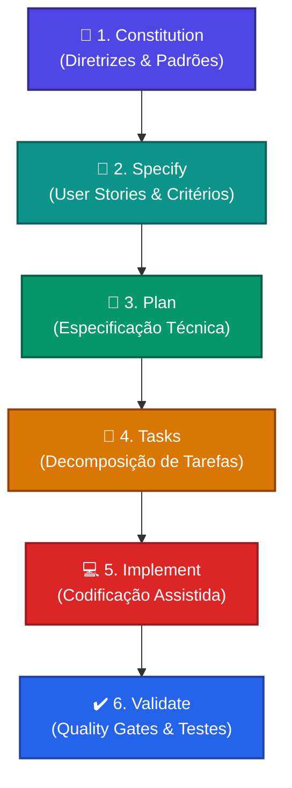

# 🏗️ AI Governance Hub & SDD Engines
### *O Cérebro Operacional de Engenharia de Software Orientada por Inteligência Artificial*

  

---

## 🎯 Nossa Visão
O **AI Governance Hub** é o ecossistema estratégico de Engenharia de IA projetado para elevar a qualidade, consistência e velocidade de entrega de software de alto nível. Unindo **Diretrizes de Governança Passiva** a **Motores de Execução Ativa**, capacitamos desenvolvedores a utilizarem assistentes inteligentes (como Cursor, Copilot, Antigravity) de forma integrada a padrões modernos de arquitetura, segurança (AppSec) e qualidade técnica.

> [!IMPORTANT]
> **Primeiros Passos:**
> *   📖 **[Manual de Onboarding Visual](./docs/MANUAL_AI_GOVERNANCE_HUB.html)** — Aprenda a dinâmica e protocolo do Hub.
> *   🚀 **[Guia de Conexão Rápida](./guia_conexao_github.md)** — Integre o seu microsserviço/projeto local ao Hub em apenas 2 segundos.

---

## 🧠 Metodologia: Spec-Driven Development (SDD)
A engenharia de software no Hub segue o fluxo do **Spec-Driven Development (SDD)**. Em vez de codificar diretamente de forma ad-hoc, o desenvolvimento é guiado por especificações ("specs") e estruturado em um pipeline rigoroso orquestrado por IA:

---

## 🔌 Motores de Execução: Os Plugins VS Code
Este repositório serve como a base de distribuição e inteligência para as **extensões de chat e automação (SDD Engines)** que integram a IA diretamente ao ambiente do desenvolvedor.

| Plugin / Engine | Foco Tecnológico | Principais Recursos | Comandos de Chat (`/`) |
| :--- | :--- | :--- | :--- |
| **`foursys-sdd-engine-java`** | **Backend Java & Spring** | Suporte a Java 21, Arquitetura Hexagonal, OpenFeign, RestClient, DLT/Retry em Kafka, MongoDB e testes unitários BDD. | `/foursys.constitution` `/foursys.specify` `/foursys.plan` `/foursys.tasks` `/foursys.implement` |
| **`foursys-sdd-engine-angular`** | **Frontend Angular v18+** | Otimização para Standalone Components, reatividade via Signals, Forms dinâmicos e roteamento avançado. | `/foursys.constitution` `/foursys.specify` `/foursys.plan` `/foursys.tasks` `/foursys.implement` |
| **`foursys-sdd-engine-hybrid`** | **Multi-Stack / Universal** | Detecção automática de tecnologia (Java, Angular, Node, COBOL) e integração com a ferramenta **Mend Advise** para AppSec. | `/foursys.selectStack` `/foursys.runMend` |
| **`playbook-engine` (Agentes)** | **Orquestração de Fases** | Mapeamento dinâmico e execução do catálogo local de Playbooks através do assistente central. | `@agentes_foursys` + `/refinar`, `/desenhar`, `/desenvolver`, `/review_angular`, `/review_java`, `/teste_angular`, `/teste_java` |

---

## 📂 Anatomia do Catálogo de Ativos (`/catalog`)
O coração do Hub está em sua estrutura modular de ativos em [**`/catalog`**](./catalog), organizados para servir de contexto direto aos agentes de IA:

### 1. 📜 [Diretrizes Globais (Constituição)](./catalog/instructions)
Instruções que ditam as "regras de ouro" arquiteturais e de qualidade de código. Garantem conformidade imediata sem adivinhação:
*   [**`HEXAGONAL_JAVA.md`**](./catalog/instructions/HEXAGONAL_JAVA.md): Padrão hexagonal estrito (Core isolado de frameworks, adapters bem definidos).
*   [**`ANGULAR_FRONTEND.md`**](./catalog/instructions/ANGULAR_FRONTEND.md): Componentes reativos modernos baseados em Signals.
*   [**`SECURITY_COMPLIANCE.md`**](./catalog/instructions/SECURITY_COMPLIANCE.md): Governança de AppSec, bloqueando vazamento de dados (LGPD) e vazamento de chaves.
*   [**`SOLID_CLEAN_CODE.md`**](./catalog/instructions/SOLID_CLEAN_CODE.md) & [**`TESTING_PATTERNS.md`**](./catalog/instructions/TESTING_PATTERNS.md): Boas práticas e padrões para testes de alta cobertura.

### 2. 👥 [Agentes Especialistas & Skills](./catalog/agents_skills)
Configuração de personas e skills específicas para que as IAs atuem como seniores especialistas na stack ativa:
*   **`#AGENTE_SPRING_FOURSYS.md`** (Java, APIs REST, Kafka, Mongo, JUnit)
*   **`#AGENTE_ANGULAR_FOURSYS.md`** (Componentes Standalone, Signals, Routing)
*   **`#AGENTE_COBOL_FOURSYS.md`** (Mainframe, modernização Batch/Online, engenharia reversa)
*   **`#AGENTE_NEGOCIO_FOURSYS.md`** (Refinamento de requisitos e User Stories)

### 3. 🏁 [A Esteira Estratégica (Playbooks de Fases)](./catalog/playbook)
Passo a passo processual dividindo a entrega de código em 6 etapas claras:
*   **Fase 0: Descoberta** — Diagramação e engenharia reversa.
*   **Fase 1: Refinamento** — Criação de histórias técnicas consistentes.
*   **Fase 2: Desenho Técnico** — Especificação arquitetural de endpoints e esquemas de dados.
*   **Fase 3: Portões de Qualidade** — Execução de checklists de code review e validação hexagonal antes do merge.
*   **Fase 4: Homologação** — Validação com foco no negócio e checklists de entrega.
*   **Fase 5: Modernização Legada** — Documentação e modernização de programas COBOL.

---

## 🚀 Como Conectar seu Projeto em 2 Segundos?
Para plugar os motores de IA deste Hub ao seu projeto atual, utilize o **Prompt de Conexão** no chat do seu assistente de IA (como Cursor, Antigravity ou Copilot):

> *"Olá! Por favor, configure meu projeto local para usar o AI Governance Hub. 1. Sincronize os arquivos locais na pasta `agentes_foursys` de forma simplificada. 2. Crie o workflow de CI/CD para automação de sincronização. 3. Adicione o `.git/info/exclude` correspondente."*

*(Para guias avançados, comandos de terminal ou conexão via scripts, consulte o [**Guia de Conexão Completo**](./guia_conexao_github.md)).*

---

## 📈 Benefícios da Governança de IA no Time
*   🛡️ **Segurança em Primeiro Lugar**: Prevenção ativa contra vulnerabilidades (OWASP Top 10) e LGPD.
*   ⚡ **Onboarding Acelerado**: Desenvolvedores recém-chegados começam a produzir no padrão corporativo no primeiro dia.
*   📉 **Redução de Débito Técnico**: IAs são guiadas a gerar código limpo, impedindo soluções improvisadas fora dos padrões acordados.
*   ⏳ **Time-to-Market Acelerado**: Menos tempo gasto desenhando infraestrutura comum, mais foco em regras e inteligência de negócio.

---
> [!TIP]
> *Dica de Produtividade: Sempre invoque os Agentes e Fases utilizando a notação de hashtag (ex: `#AGENTE_SPRING_FOURSYS.md` usando `#FASE3_VALIDACAO_HEXAGONAL.md`) para garantir que o contexto técnico de IA esteja 100% calibrado.*

---
© 2026 Foursys - Engenharia de Valor & Inteligência Artificial.
