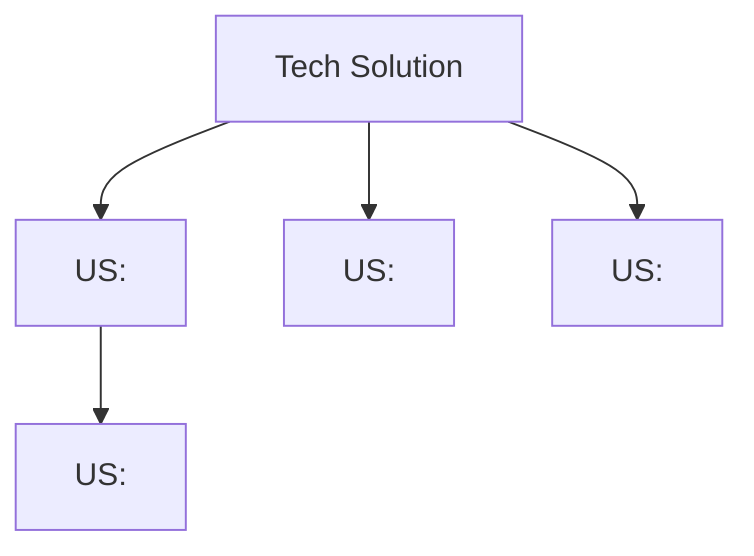

# Geração de User Stories a partir de Feature Refinada

Decompõe um épico Jira em User Stories dimensionadas para sprints ágeis, escritas seguindo as regras da skill `apf-rules` para que toda funcionalidade, integração e entidade de dados fique explícita — sem exibir estimativas de pontuação ao usuário.

<HARD-GATE>
Nenhuma US deve ser criada no Jira antes de revisão e aprovação explícita do usuário.
</HARD-GATE>

## Pré-requisitos

- Repositório de documentação (`<area>-doc-<projeto>`) com o ADR ou RFC gerado pelo `tl-refinar-feature`.
- Variável `ATLASSIAN_TOKEN` configurada para a skill `jira-api`.

## Decomposição para Sprints

Cada US deve ser **implementável em uma sprint** (~2 semanas). A decomposição prioriza **paralelismo** — quanto mais USs puderem rodar simultaneamente, melhor.

**Quando decompor:**
- Múltiplos serviços com responsabilidades distintas → separe por serviço
- Múltiplos fluxos (inclusão + consulta + alteração) → separe por processo elementar
- Múltiplos canais (API + batch + evento) → separe por canal
- Integrações externas complexas → extraia como US dedicada

**Quando agregar:**
- USs no mesmo serviço e contexto que não fazem sentido isoladamente
- Validação ou regra de negócio que depende de outra US para existir

Artefatos compartilhados entre USs devem ser extraídos para o **Tech Solution** (Passo 5).

## Saída

```
<centro-de-custo>-doc-<projeto>/EPIC-<JIRA_KEY>/
├── user-stories/
│   ├── <JIRA_KEY>-<slug>.md
│   └── ...
└── tech-solution/          ← só quando houver shared concerns
    └── tech-solution.md
```

## Processo

### Passo 1 — Carregar contexto

```bash
python skills/jira-api/scripts/jira_cli.py get-issue --key ${{jira-key}}
```

Leia o ADR/RFC aprovado. Extraia:
- Tipo de projeto (novo ou melhoria)
- Serviços impactados e responsabilidades
- Processos elementares — ações que deixam o negócio em estado consistente
- Entidades de dados (ALI) e sistemas externos (AIE)
- Regras de negócio e critérios de aceite do épico

### Passo 2 — Inventário de componentes

> Obrigatório ANTES de qualquer decomposição.

Percorra o ADR/RFC e liste todos os componentes funcionais. Carregue a skill `apf-rules` para garantir que a identificação de componentes siga as regras corretas (o que é ALI vs. configuração técnica, o que é PE vs. sub-passo, etc.).

```
| # | Componente | Tipo | Serviço | Origem no ADR/RFC |
|---|-----------|------|---------|-------------------|
| 1 | Roteamento canal batch/API | EE | dupe-srv-opt | Seção X |
| 2 | Collection Rastreabilidade | ALI novo | dupe-srv-adapter | Seção Y |
| 3 | Endpoint DUP0515 Nuclea | AIE | dupe-srv-adapter | Seção Z |
```

**Checkpoint:** verifique se todos os componentes do ADR/RFC estão no inventário. Se algum foi omitido, adicione-o.

### Passo 3 — Decompor em User Stories

Agrupe componentes em USs seguindo as regras de decomposição para sprints. Priorize:
1. Paralelismo — máximo de USs simultâneas
2. Independência — minimize dependências; extraia shared concerns
3. Tamanho de sprint — cada US completável em uma sprint

### Passo 4 — Validar completude

Produza tabela de rastreabilidade `Inventário → USs`. Todos os componentes do inventário devem estar atribuídos a pelo menos uma US.

> **HARD-GATE:** Se houver componentes não atribuídos, pare e atribua antes de prosseguir.

Avalie dimensionamento:
- US toca múltiplos serviços ou tem 4+ componentes complexos → decomponha
- US tem apenas 1 componente trivial → agregue a outra US coesa
- US depende de outra US (exceto Tech Solution) → reorganize para paralelismo

### Passo 5 — Redigir as User Stories

Carregue a skill `apf-rules` para redigir cada US. A skill garante que a escrita torne visível todas as funcionalidades, integrações e entidades de dados. Passe para a skill:
- Os componentes atribuídos à US (do inventário)
- O tipo de projeto (novo ou melhoria)
- O ADR/RFC como fonte de regras técnicas

A skill `apf-rules` produz USs com a estrutura correta: APOIO APF, IDENTIFICAÇÃO, Regras de Negócio (linguagem de negócio pura), Regras Técnicas (detalhamento completo), Critérios de Aceite (BDD), Dependências, Fora do Escopo, Riscos.

<HARD-GATE>
Não inclua estimativas numéricas de pontuação APF (PF, PFM, totais) em nenhuma US gerada, nem no sumário apresentado ao usuário. Instrua a skill `apf-rules` a omitir qualquer cálculo ou tabela de estimativa na saída. O objetivo é **escrever corretamente** para que a contagem seja maximizada naturalmente pela estrutura e vocabulário da US.
</HARD-GATE>

Salve cada US em `<centro-de-custo>-doc-<projeto>/EPIC-<JIRA_KEY>/user-stories/<slug>.md`.

### Passo 5.5 — Tech Solution (se aplicável)

Analise o conjunto de USs para shared concerns — artefatos usados por 2+ USs:
- Models / DTOs compartilhados
- Interfaces / contratos comuns
- Infraestrutura compartilhada (Kafka topics, collections, schemas)
- Integrações externas (AIEs) consumidas por múltiplas USs

Se não houver shared concerns, pule este passo. Se houver, gere `tech-solution.md` usando o template em `references/tech-solution-template.md` com dados reais e completos (sem placeholders). Adicione a dependência nas USs afetadas.

### Passo 5.6 — Gerar DAG de execução

Após definir todas as USs e o Tech Solution (se aplicável), gere o arquivo de DAG em:

```
<centro-de-custo>-doc-<projeto>/EPIC-<JIRA_KEY>/execution-dag.md
```

O arquivo deve conter um diagrama Mermaid mostrando a ordem de execução e o paralelismo possível:

```markdown
# DAG de Execução — <JIRA_KEY>

## Paralelismo disponível

**X de Y itens podem ser desenvolvidos em paralelo** após o Tech Solution.

## Diagrama



## Legenda de dependências

| Item | Depende de | Motivo |
|------|-----------|--------|
| US: <título> | Tech Solution | Usa `<artefato compartilhado>` |
| US: <título> | — | Independente |
```

Regras do DAG:
- Se não há Tech Solution, e todas as USs são independentes, o diagrama mostra todos os nós em paralelo sem arestas
- Inclua apenas dependências reais; não crie dependências artificiais entre USs que podem rodar em paralelo
- Nós do Tech Solution devem ter estilo diferenciado: `TS[Tech Solution]:::task` com `classDef task fill:#f5a623`

### Passo 6 — Revisão pelo usuário

Apresente sumário:

```
## User Stories geradas — <JIRA_KEY>

| Arquivo | Título | Componentes | Serviço(s) |
|---------|--------|-------------|------------|
| <JIRA_KEY>-consulta-saldo.md | <título> | 1× EE | dupe-srv-opt |
| <JIRA_KEY>-integracao-nuclea.md | <título> | 1× EE + 1× AIE | dupe-srv-adapter |

**Paralelismo:** X de Y USs podem ser desenvolvidas simultaneamente.
```

Se houver Tech Solution, apresente tabela de artefatos compartilhados.

Ofereça opções: **Aprovar todas** | **Rejeitar todas** | **Revisar parcialmente** (indicar IDs).
Só avance após aprovação explícita.

### Passo 7 — Criar no Jira

#### 7.1 — Tech Solution (se aplicável)

Crie primeiro como **Task** vinculada ao épico:

```bash
python skills/jira-api/scripts/jira_cli.py create-issue \
  --project <PROJECT_KEY> --type Task \
  --summary "Tech Solution — <feature>" \
  --description "<Jira Wiki Markup>" --parent ${{jira-key}}
```

#### 7.2 — User Stories

Para cada US aprovada, converta Markdown → Jira Wiki Markup e crie como **Story**:

```bash
python skills/jira-api/scripts/jira_cli.py create-issue \
  --project <PROJECT_KEY> --type Story \
  --summary "<título>" \
  --description "<Jira Wiki Markup>" --parent ${{jira-key}}
```

Se a criação falhar, informe o erro e aguarde instrução.

### Passo 8 — Resultado final

Apresente tabela com arquivo local, key Jira, tipo e título de cada item criado.

Ofereça próximo passo:
- **Planejar todas as USs em paralelo:** `tl-gerar-plano <adr/rfc> --all-us`
- **Planejar uma US específica:** `tl-gerar-plano <adr/rfc> --us <caminho>`

## Regras-chave

- **Inventário primeiro** — complete antes de decompor; nunca omita componentes
- **Sprint-sized** — cada US cabe em uma sprint; decomponha se não couber
- **Paralelismo** — maximize USs simultâneas; extraia shared concerns para Tech Solution
- **Uma US por objetivo** — nunca combine processos elementares distintos
- **Escrita via apf-rules** — a skill garante que funcionalidades, ALIs e AIEs fiquem explícitos; **nunca** inclua estimativas numéricas de pontuação APF em USs, tabelas ou sumário
- **DAG de execução** — sempre gere `<centro-de-custo>-doc-<projeto>/EPIC-<JIRA_KEY>/execution-dag.md` com diagrama Mermaid mostrando paralelismo real
- **Rastreabilidade** — cada componente do inventário → US; cada funcionalidade → RN + CA
- **Separação negócio × técnico** — RNs sem termos técnicos; RTs com detalhamento completo
