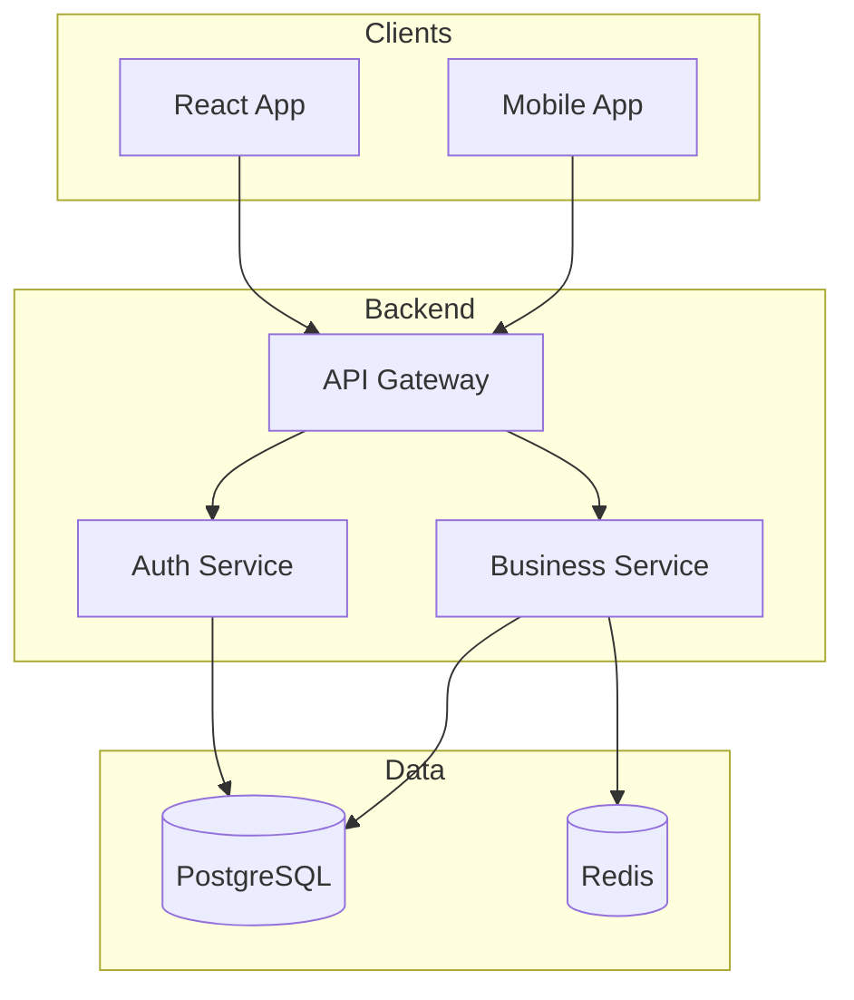
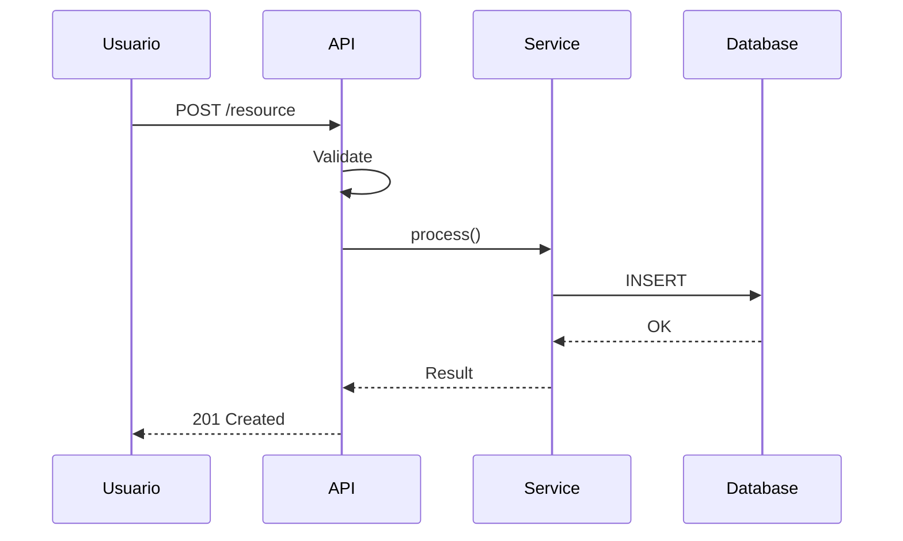
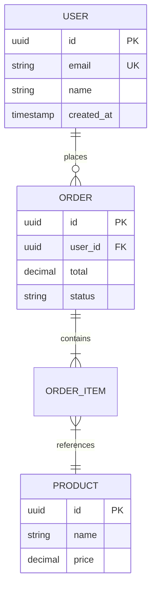
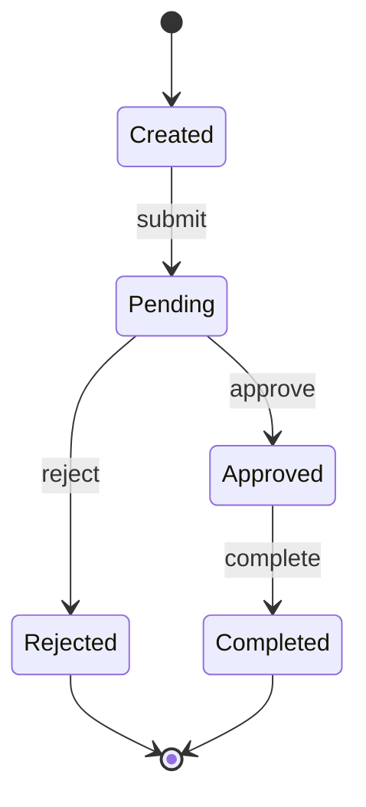
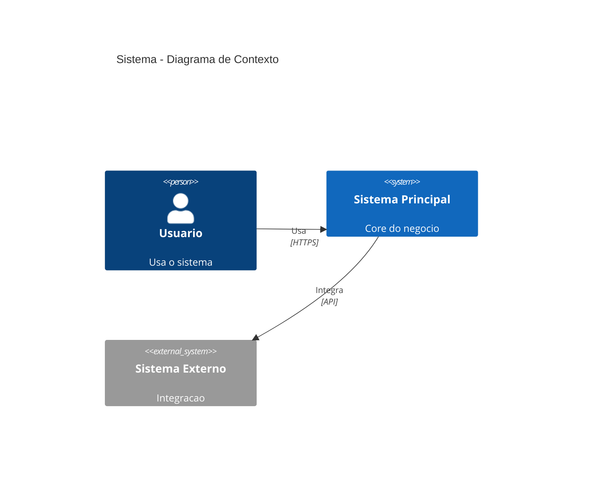

## Objetivo

Gerar diagramas Mermaid precisos a partir de análise de código ou documentação técnica,
com sintaxe validada e nomes que reflitam a realidade do projeto.

## Tipos de Diagramas

### 1. Flowchart - Arquitetura de Componentes



**Quando usar:** Visao geral da arquitetura, componentes e suas conexoes.

### 2. Sequence Diagram - Fluxos de Request



**Quando usar:** Fluxos de request/response, integrações, debugging.

### 3. ERD - Modelo de Dados



**Quando usar:** Documentar schema do banco, relacoes entre entidades.

### 4. State Diagram - Ciclo de Vida



**Quando usar:** Estados de uma entidade, maquinas de estado.

### 5. C4 Context - Visao de Sistema



**Quando usar:** Documentacao C4 Model, visao de alto nivel.

## Regras de Geracao

Use nomes reais (classes, módulos, tabelas do código) — nomes genéricos tornam o diagrama
inútil para quem precisa navegar na codebase. Mantenha diagramas focados (máx 10-15
componentes) para que o leitor absorva a informação sem ter que decifrar um mapa mental.

1. **Nomes devem corresponder ao codigo real**
   - Use nomes de classes, modulos, tabelas reais
   - Nao invente nomes genericos

2. **Mantenha simplicidade**
   - Max 10-15 componentes por diagrama
   - Divida em multiplos diagramas se necessario

3. **Valide sintaxe**
   - Verifique a sintaxe antes de entregar — um diagrama com erro de sintaxe não renderiza
     e não tem valor para o leitor
   - Evite caracteres especiais em labels

4. **Inclua legenda quando necessario**
   - Cores, formas, linhas devem ser explicadas

## Estilo Padrao

```mermaid
%%{init: {'theme': 'base', 'themeVariables': {
  'primaryColor': '#0066cc',
  'primaryTextColor': '#ffffff',
  'lineColor': '#2c3e50'
}}}%%
```

## Exemplo de Uso

```
> Gere um diagrama de arquitetura para este projeto
> Tipo: flowchart
> Inclua: frontend, backend, banco de dados, servicos externos
```

```
> Gere um diagrama de sequencia para o fluxo de checkout
> Participantes: usuario, frontend, API, payment service, Stripe
```

```
> Gere um ERD baseado nos schemas Prisma do projeto
```