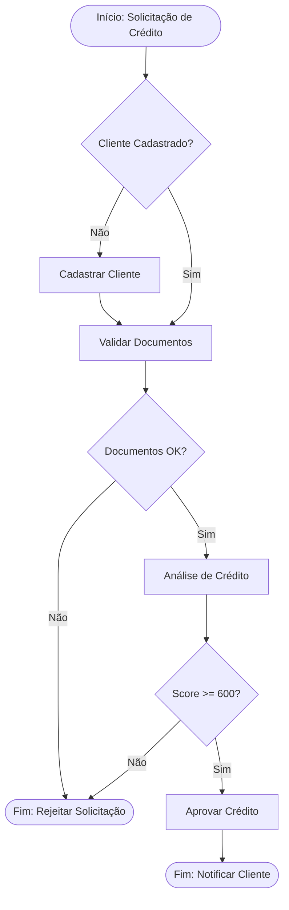
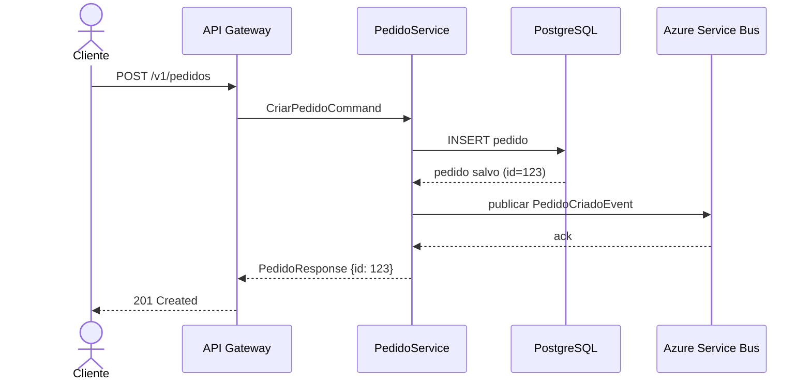
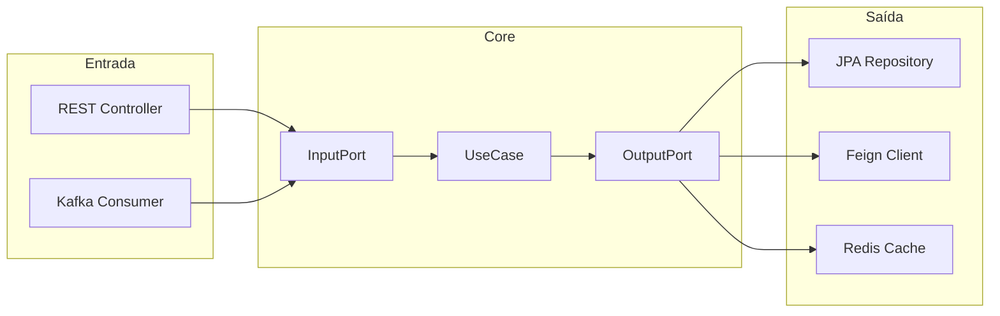
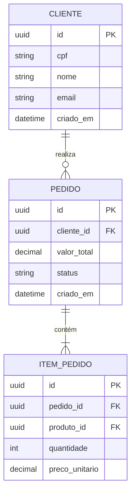
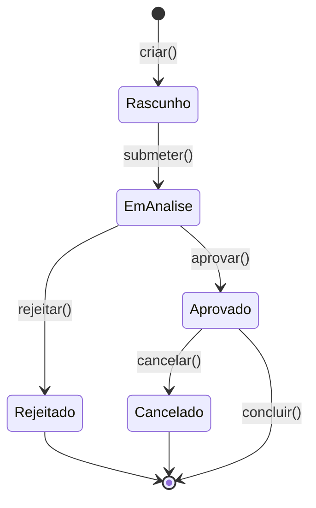

# Mermaid Diagram Generator

Gere diagramas Mermaid validados sintaticamente. Use o tipo de diagrama correto para o contexto.

## Tipos Disponíveis e Quando Usar

| Tipo | Caso de Uso |
|------|------------|
| `flowchart` | Fluxo de negócio, decisões, processos |
| `sequenceDiagram` | Integração entre sistemas, chamadas HTTP/mensageria |
| `graph` | Arquitetura de componentes, dependências |
| `erDiagram` | Modelo de dados, entidades JPA |
| `stateDiagram-v2` | Ciclo de vida de entidade, máquina de estados |

## Flowchart — Fluxo de Negócio



**Regras sintáticas:**
- `TD` = top-down, `LR` = left-right
- `[Retângulo]`, `{Losango}`, `([Oval])`, `((Círculo))`
- Rótulos de seta: `-->|texto|`

## Sequence Diagram — Integração Entre Sistemas



**Regras sintáticas:**
- `->>` síncrono, `-->>` resposta, `--)` assíncrono
- `actor` para usuário humano, `participant` para sistema
- `Note over A,B:` para anotações

## Graph — Arquitetura Hexagonal



## ER Diagram — Modelo de Dados



## State Diagram — Ciclo de Vida



## Validação Sintática

Antes de entregar um diagrama, verifique:

1. **Sem espaços em IDs**: `meuNo` não `meu No` (causa parse error)
2. **Rótulos com caracteres especiais**: usar aspas `["texto com : dois pontos"]`
3. **Sequência**: `participant` declarado antes do uso
4. **ER**: tipo de dado em minúsculo (`string`, `int`, `decimal`, `uuid`, `datetime`)
5. **Subgraph**: sempre fechar com `end`

## Anti-patterns

```
# PROIBIDO: ID com espaço
flowchart TD
    meu node --> outro nó  ❌

# CORRETO:
flowchart TD
    meuNode --> outroNo  ✅
    
# PROIBIDO: diagrama sem direção
flowchart
    A --> B  ❌ (falta TD/LR)

# CORRETO:
flowchart LR
    A --> B  ✅
```
