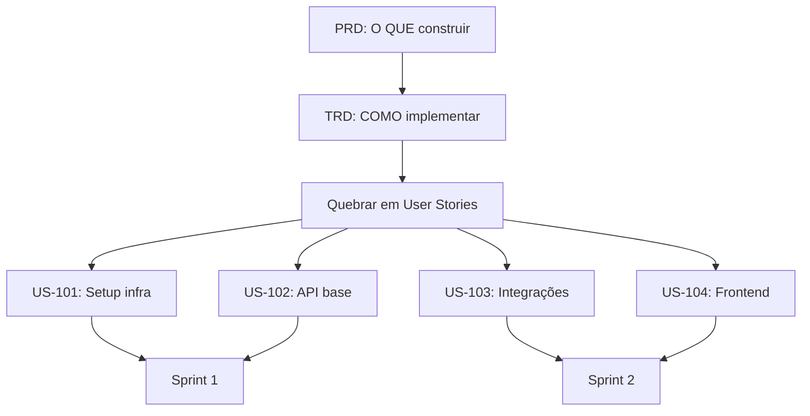
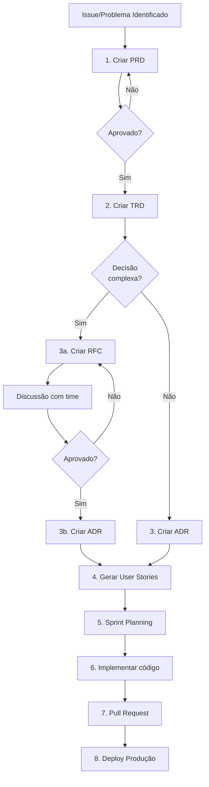

# Tech Spec Documentation - Guia de Uso

Skill para geração de documentação técnica padronizada seguindo templates e boas práticas de engenharia de software.

## O que esta skill faz?

Esta skill permite gerar cinco tipos principais de documentos técnicos:

- **PRD (Product Requirements Document)**: Define o problema e requisitos de produto
- **TRD (Technical Reference Document)**: Detalha a solução técnica e arquitetura
- **RFC (Request for Comments)**: Propõe mudanças técnicas para discussão
- **ADR (Architecture Decision Record)**: Registra decisões arquiteturais tomadas
- **User Stories**: Documenta histórias de usuário no formato padrão

## Quando usar cada documento

| Documento      | Quando usar             | Quem escreve        | Quem revisa         |
| -------------- | ----------------------- | ------------------- | ------------------- |
| **PRD**        | Início de épico/feature | PM/PO + Tech Lead   | Time todo           |
| **TRD**        | Após aprovação do PRD   | Tech Lead/Arquiteto | Engenheiros         |
| **RFC**        | Mudanças significativas | Qualquer engenheiro | Arquiteto/Tech Lead |
| **ADR**        | Após decisão tomada     | Quem decidiu        | Para registro       |
| **User Story** | Para backlog/sprint     | PO + Tech Lead      | PO + Team           |

## Como usar

### 1. Gerando um PRD (Product Requirements Document)

Use quando precisar documentar **o que** será construído e **por quê**.

#### O que incluir no prompt para PRD

Para obter um PRD completo e útil, forneça as seguintes informações:

**Requisitos de Negócio**

- Problema/oportunidade identificada
- Objetivos de negócio (Business Goals)
- Justificativa para investimento
- Stakeholders envolvidos

**Regras Funcionais**

- Comportamentos esperados do sistema
- Fluxos principais e alternativos
- Casos de uso detalhados
- Validações e regras de negócio

**Regras Não-Funcionais**

- Performance esperada (tempo de resposta, throughput)
- Disponibilidade (SLA, uptime)
- Segurança e compliance
- Escalabilidade e capacidade
- Usabilidade e acessibilidade

**Métricas de Acompanhamento**

- KPIs para medir sucesso
- OKRs associados (se já identificados)
- Baseline atual vs Meta desejada
- Frequência de medição

**Integrações Necessárias**

- Sistemas externos a integrar
- APIs a consumir ou expor
- Eventos a publicar/consumir
- Dependências de outros times/sistemas

**Exemplo de prompt detalhado:**

```
Crie um PRD para o sistema de notificações push em tempo real com:

- Objetivo: Aumentar engajamento em 30% nos próximos 3 meses
- KPI: Taxa de abertura de notificações >15%
- Requisitos funcionais:
  * Envio de notificações personalizadas por segmento de usuário
  * Agendamento de notificações
  * Limite de 3 notificações por dia por usuário
- Requisitos não-funcionais:
  * Latência <500ms para envio
  * Suporte a 1M notificações/hora
  * Disponibilidade 99.9%
- Integrações:
  * Firebase Cloud Messaging
  * Sistema de CRM para segmentação
  * Analytics para tracking
```

O que será gerado:

- Descrição do problema e impacto no negócio
- Objetivos com métricas quantificáveis
- Requisitos funcionais detalhados
- Requisitos não-funcionais com SLAs
- Critérios de aceite mensuráveis
- Casos de uso com fluxos principais e alternativos
- Mapa de integrações necessárias
- Riscos e dependências identificadas

### 2. Gerando um TRD (Technical Reference Document)

Use após o PRD para documentar **como** a solução será implementada.

#### Preparando o contexto para TRD

**IMPORTANTE:** Para gerar um TRD completo e preciso, o Copilot precisa de contexto dos sistemas envolvidos.

##### Opção 1: Adicionar repositórios ao workspace

1. **Abra todos os repositórios relacionados no mesmo workspace:**
   - Sistema principal que será modificado
   - Serviços que serão integrados
   - Bibliotecas compartilhadas

2. **O Copilot terá acesso direto para:**
   - Analisar código existente
   - Identificar padrões arquiteturais
   - Verificar dependências
   - Entender estrutura de dados

**Exemplo de estrutura do workspace:**

```
meu-workspace/
├── api-notifications/          # Repo principal
├── api-user-service/          # Sistema de usuários
├── shared-libraries/          # Libs compartilhadas
└── infrastructure/            # IaC e configs
```

##### Opção 2: Fornecer resumo dos sistemas

Se não puder abrir os repos, forneça um resumo de cada sistema:

**Template de resumo:**

```
## Sistema: api-user-service
**Responsabilidade:** Gerenciamento de usuários e autenticação
**Stack:** Java 17 + Spring Boot 3.2 + PostgreSQL
**Endpoints relevantes:**
- GET /users/{id} - Buscar usuário
- GET /users/segments - Listar segmentos
**Arquitetura:** Hexagonal (ports & adapters)
**Observabilidade:** Prometheus + Grafana

## Sistema: api-notifications
**Responsabilidade:** Envio de notificações multi-canal
**Stack:** Node.js 20 + Express + Redis + MongoDB
**Integrações:** FCM, SNS, SendGrid
**Arquitetura:** Microserviços com event-driven
**Observabilidade:** DataDog
```

##### Opção 3: Usar Copilot para gerar chat instructions

**Gere chat instructions de cada repositório para contexto:**

```bash
# Em cada repositório, peça ao Copilot:
"Analise este repositório e gere um chat instruction file
(.github/copilot-instructions.md) descrevendo:
- Propósito do sistema
- Arquitetura e padrões utilizados
- Stack tecnológico
- Principais componentes e responsabilidades
- Convenções de código
- Como rodar localmente"
```

Depois, ao criar o TRD, referencie:

```
Crie um TRD baseado no PRD-001 consultando:
- .github/copilot-instructions.md do repo api-notifications
- .github/copilot-instructions.md do repo api-user-service
```

#### O que incluir no prompt para TRD

**Exemplo de prompt completo:**

```
Crie um TRD baseado no PRD-001 para implementar o sistema de notificações.

Contexto dos sistemas (consulte os repositórios abertos no workspace):

1. api-notifications (repo principal)
   - Arquitetura event-driven com Kafka
   - Node.js + TypeScript + Redis
   - Já possui integração com FCM

2. api-user-service
   - Fornece dados de usuários e segmentação
   - Spring Boot com arquitetura hexagonal
   - Expõe REST API e eventos via Kafka

3. shared-event-schemas
   - Schemas Avro dos eventos
   - Validação e versionamento

Incluir:
- Diagrama de arquitetura C4 (contexto e containers)
- Diagrama de sequência para fluxo principal
- Modelo de dados (schemas de eventos e collections MongoDB)
- Plano de testes (unitários, integração, carga)
- Observabilidade (métricas, logs, traces)
- Plano de rollback
```

O que será gerado:

- Arquitetura detalhada com contexto dos sistemas existentes
- Diagramas alinhados com padrões já utilizados
- Stack tecnológico compatível com o ecossistema
- Detalhes de implementação respeitando convenções
- Plano de integração entre sistemas
- Estratégia de testes adequada à arquitetura
- Observabilidade integrada às ferramentas existentes
- Guia de deployment e rollback

### 3. Criando uma RFC (Request for Comments)

Use quando precisar **propor** uma mudança técnica **significativa** para discussão e obter consenso do time.

**IMPORTANTE:** RFC é para **propor e discutir** antes de decidir. Não use RFC para documentar decisões já tomadas (use ADR).

#### Quando criar uma RFC

**Situações que requerem RFC:**

- Mudança de tecnologia core (linguagem, framework, banco de dados)
- Alteração de arquitetura significativa (monolito → microserviços)
- Adoção de novo padrão/convenção que impacta todo o time
- Mudança que afeta múltiplos sistemas/times
- Decisões com alto custo de reversão
- Trade-offs complexos que precisam de debate

**Situações que NÃO requerem RFC:**

- Decisões locais a um serviço/módulo
- Correções de bugs
- Refatorações internas
- Decisões já tomadas (use ADR)

#### O que incluir no prompt para RFC

**Template de informações:**

**Contexto e Motivação**

- Problema atual que motivou a proposta
- Impacto no negócio/produto
- Urgência e criticidade
- Stakeholders afetados

**Alternativas Analisadas**

- No mínimo 2-3 opções viáveis (incluindo "não fazer nada")
- Para cada alternativa:
  - Descrição técnica
  - Pros detalhados
  - Contras detalhados
  - Esforço estimado (story points/tempo)
  - Custo (infra, licenças, treinamento)

**Critérios de Avaliação**

- Performance e escalabilidade
- Manutenibilidade
- Curva de aprendizado do time
- Ecossistema e comunidade
- Custo total (TCO)
- Time to market
- Compatibilidade com stack existente

**Trade-offs e Riscos**

- O que ganhamos vs o que perdemos
- Riscos técnicos identificados
- Plano de mitigação de riscos
- Estratégia de migração/rollback

**Recomendação**

- Opção recomendada com justificativa
- Próximos passos se aprovado
- Critérios de sucesso

**Exemplo de prompt detalhado:**

```
Crie uma RFC propondo a migração do banco de dados de MySQL para PostgreSQL:

Contexto:
- Sistema de e-commerce com 500k usuários ativos
- MySQL 5.7 atingindo limites de performance em queries complexas
- Custo atual: $3k/mês em RDS MySQL
- Time tem experiência com MySQL, pouca com PostgreSQL

Alternativas a avaliar:
1. Migrar para PostgreSQL 15
   - Melhor suporte a JSON e queries complexas
   - Custo estimado: $2.5k/mês
   - Esforço: 3 sprints (migração + testes)
   - Requer treinamento do time

2. Upgrade para MySQL 8.0
   - Melhorias de performance
   - Sem mudança de paradigma
   - Custo: $3.5k/mês
   - Esforço: 1 sprint

3. Adicionar cache Redis + manter MySQL
   - Resolve performance sem migração
   - Custo adicional: $500/mês
   - Complexidade de cache invalidation
   - Esforço: 2 sprints

Critérios de decisão:
- Performance (peso 40%): queries <100ms P95
- TCO 12 meses (peso 30%): incluir infra + eng time
- Risco de migração (peso 20%): downtime aceitável <4h
- Fit tecnológico (peso 10%): alinhamento com roadmap

Riscos identificados:
- Downtime durante migração
- Incompatibilidades de sintaxe SQL
- Curva de aprendizado do time
- Regressões não detectadas

Mitigação:
- Blue-green deployment
- Testes de carga pré-produção
- Treinamento 2 semanas antes
- Rollback plan testado
```

O que será gerado:

- Seção de contexto clara e objetiva
- Análise comparativa estruturada das alternativas
- Matriz de decisão com critérios ponderados
- Trade-offs explícitos de cada opção
- Recomendação fundamentada com dados
- Riscos mapeados e plano de mitigação
- Seção para capturar feedback do time
- Próximos passos se aprovado

### 4. Registrando uma ADR (Architecture Decision Record)

Use para **documentar decisões** arquiteturais **já tomadas** (não para propor ou discutir).

**IMPORTANTE:**

- ADR é um **registro histórico imutável** de decisões
- Use RFC para **propor** e ADR para **documentar** o resultado
- ADRs nunca são deletadas, apenas supersedidas por novas ADRs

#### Quando criar uma ADR

**Decisões que merecem ADR:**

- Escolhas arquiteturais significativas
- Adoção de padrões e convenções
- Seleção de tecnologias core
- Trade-offs importantes que foram feitos
- Decisões que impactam múltiplos sistemas
- Escolhas que terão impacto de longo prazo

**Regra de ouro:** Se alguém pode perguntar no futuro "por que fizemos assim?", documente em ADR.

#### Fluxo RFC → ADR

```
RFC (proposta) → Discussão → Decisão → ADR (registro)
```

**Exemplo:**

1. **RFC-003**: "Devemos migrar para PostgreSQL?" (proposta com alternativas)
2. **Discussão**: Time debate, levanta pontos, vota
3. **Decisão**: Aprovado migrar para PostgreSQL
4. **ADR-015**: "Uso de PostgreSQL como banco principal" (documenta decisão final)

#### O que incluir no prompt para ADR

**Template de informações:**

**Contexto da Decisão**

- Qual era a situação/problema
- Quando a decisão foi tomada
- Quem participou da decisão
- Qual documento precedeu (RFC, discussão, reunião)

  **Alternativas Consideradas**

- Quais opções foram avaliadas
- Por que cada uma foi descartada
- Breve resumo de pros/contras

  **Decisão Tomada**

- O que foi decidido (objetivo e claro)
- Justificativa principal
- Critérios que pesaram na decisão

  **Consequências**

- Impactos positivos esperados
- Impactos negativos/trade-offs aceitos
- Mudanças necessárias em outros sistemas
- Dívidas técnicas assumidas

  **Status e Metadata**

- Status: Proposed | Accepted | Deprecated | Superseded
- Data da decisão
- Supersedes: ADR anterior (se aplicável)
- Superseded by: ADR nova (quando obsoleta)

**Exemplo de prompt detalhado:**

```
Crie uma ADR documentando a decisão de usar WebSocket para comunicação em tempo real:

Contexto:
- Decisão tomada em 15/01/2026 após discussão da RFC-008
- Participantes: Time de backend + arquiteto + tech lead frontend
- Problema: Usuários precisam ver atualizações sem refresh (chat, notificações)
- Sistema: Plataforma de colaboração com ~10k usuários simultâneos

Alternativas consideradas:
1. **WebSocket** (escolhida)
   - Comunicação bidirecional full-duplex
   - Baixa latência (~50ms)
   - Requer gerenciamento de conexões persistentes

2. **Server-Sent Events (SSE)**
   - Unidirecional (apenas server → client)
   - Descartado: não suporta envio do client sem HTTP adicional
   - Mais simples, mas limitado

3. **Long Polling**
   - Compatível com qualquer navegador
   - Descartado: latência alta (~1s) e overhead de requisições

Decisão:
- Implementar WebSocket usando Socket.IO
- Socket.IO escolhido por: fallback automático, reconnection, rooms
- Infraestrutura: Usar sticky sessions no load balancer

Consequências positivas:
- Latência <100ms para mensagens
- Experiência de usuário em tempo real
- Redução de 90% no número de requisições HTTP

Consequências negativas/trade-offs:
- Complexidade adicional no gerenciamento de conexões
- Dificuldade em debugging (WebSocket não aparece em network tab)
- Requer Redis para sincronizar entre instâncias (sticky sessions)
- Custo de infra: +20% por conexões persistentes

Dívida técnica assumida:
- Monitoramento de conexões WebSocket precisa ser implementado (Q2/2026)
- Testes de carga para 50k conexões simultâneas (Q2/2026)

Status: Accepted
Data: 2026-01-15
Supersedes: ADR-003 (que usava polling)
```

O que será gerado:

- Título claro no formato: "ADR-XXX: [Decisão tomada]"
- Contexto histórico da decisão
- Alternativas com razão de descarte
- Decisão final objetiva e clara
- Consequências positivas e negativas documentadas
- Metadata (status, datas, relacionamentos)
- Imutável: mudanças futuras = novo ADR que supersede

### 5. Criando User Stories

Use para **quebrar** a implementação descrita no **PRD + TRD** em **User Stories menores** que podem ser implementadas em sprints.

**IMPORTANTE:** User Stories devem ser geradas **APÓS** ter PRD e TRD aprovados, pois elas decompõem a solução técnica em entregas incrementais.

#### Processo de quebra PRD/TRD → User Stories



#### Estratégias de quebra

**Por camada técnica** (para sistemas novos)

- US-101: Setup de infraestrutura e CI/CD
- US-102: Modelo de dados e migrations
- US-103: API endpoints (CRUD básico)
- US-104: Integrações externas
- US-105: Interface de usuário
- US-106: Testes e documentação

  **Por fluxo de valor** (recomendado - entrega valor a cada sprint)

- US-201: Fluxo principal funcional (happy path)
- US-202: Tratamento de erros e validações
- US-203: Casos de uso alternativos
- US-204: Performance e otimizações
- US-205: Integrações adicionais
- US-206: Melhorias de UX

  **Por componente/serviço** (para microserviços)

- US-301: Serviço de autenticação
- US-302: Serviço de notificações
- US-303: Serviço de agendamento
- US-304: Gateway API
- US-305: Frontend web

#### O que incluir no prompt para User Stories

**Referências obrigatórias:**

- PRD relacionado (ex: PRD-001)
- TRD relacionado (ex: TRD-001)
- Seção específica do TRD a implementar

**Informações adicionais:**

- Estratégia de quebra desejada
- Capacidade do sprint (story points/dias)
- Priorização de requisitos (must-have vs nice-to-have)
- Dependências técnicas entre stories

**Exemplo de prompt detalhado:**

```
Com base no PRD-001 e TRD-001 (sistema de notificações push),
quebre a implementação em User Stories usando estratégia de fluxo de valor.

Contexto do PRD/TRD:
- Sistema de notificações push em tempo real
- Backend: Node.js + Redis + MongoDB
- Frontend: React Native (iOS/Android)
- Integrações: FCM, API de usuários, Analytics
- Arquitetura: Event-driven com Kafka

Requisitos de quebra:
- Sprint de 2 semanas (10 dias úteis)
- Capacidade: 40 story points por sprint
- Prioridade: MVP primeiro, otimizações depois
- Cada US deve ser entregável e testável independentemente

Gerar User Stories para:
1. MVP (US-101 a US-103): Sistema básico funcional
   - US-101: Setup infra + CI/CD (5 pts)
   - US-102: API de envio de notificações + integração FCM (13 pts)
   - US-103: Frontend para receber e exibir notificações (8 pts)
   Total Sprint 1: 26 pts

2. Funcionalidades Core (US-104 a US-106):
   - US-104: Segmentação de usuários (8 pts)
   - US-105: Agendamento de notificações (13 pts)
   - US-106: Limite de notificações por dia (5 pts)
   Total Sprint 2: 26 pts

3. Observabilidade (US-107 a US-108):
   - US-107: Métricas e monitoramento (8 pts)
   - US-108: Testes de carga e performance (13 pts)
   Total Sprint 3: 21 pts

Para cada User Story, incluir:
- Título no formato: "Como [usuário], eu quero [ação] para [benefício]"
- Link para PRD-001 e TRD-001 (seção específica)
- Critérios de aceite técnicos (baseados no TRD)
- Critérios de aceite funcionais (baseados no PRD)
- Dependências de outras USs
- Estimativa em story points
- Tasks técnicas detalhadas
- Definition of Done
```

O que será gerado:

- **Conjunto de User Stories sequenciais** que implementam o PRD/TRD
- Cada US com:
  - Formato padrão: "Como... Eu quero... Para..."
  - Referência explícita ao PRD e TRD
  - Critérios de aceite técnicos (do TRD)
  - Critérios de aceite funcionais (do PRD)
  - Tasks de implementação detalhadas
  - Estimativas de esforço
  - Dependências entre stories
  - Testes necessários
  - Definition of Done
- **Mapa de dependências** entre User Stories
- **Sugestão de distribuição** em sprints
- **Versão formatada para Jira** (opcional)

## Estrutura de arquivos recomendada

Organize seus documentos seguindo esta estrutura:

```
docs/
├── prd/                    # Product Requirements
│   ├── PRD-001-notifications.md
│   └── PRD-002-analytics.md
├── trd/                    # Technical Reference
│   ├── TRD-001-notifications.md
│   └── TRD-002-analytics.md
├── rfc/                    # Propostas técnicas
│   └── RFC-001-database-migration.md
├── adr/                    # Decisões arquiteturais
│   ├── ADR-001-websocket-choice.md
│   └── ADR-002-cloud-provider.md
├── stories/                # User Stories
│   ├── US-12313.md
│   └── US-12313-JIRA.md   # Versão formatada para Jira
└── diagrams/              # Diagramas complementares
    ├── architecture.mmd
    └── sequence-flow.mmd
```

## Workflow completo



**Ordem recomendada:**

1. **PRD** - Define o problema, requisitos de negócio e métricas de sucesso
2. **TRD** - Detalha a solução técnica, arquitetura e integrações
3. **RFC** (opcional) - Para decisões complexas que precisam debate do time
4. **ADR** - Registra decisões arquiteturais tomadas (após RFC ou decisões diretas)
5. **User Stories** - Quebra PRD+TRD em histórias implementáveis por sprint
6. **Implementação** - Desenvolver código seguindo as User Stories

**Quando pular etapas:**

- **Pular RFC**: Decisões simples ou já consensadas (ir direto para ADR)
- **Pular ADR**: Mudanças triviais sem impacto arquitetural
- **Pular User Stories**: Spikes técnicas ou POCs pequenas

## Usando os scripts (opcional)

A skill também fornece scripts para automação:

### Gerar documentos via linha de comando

```bash
# Gerar PRD
./scripts/generate-prd.sh "Sistema de Notificações" docs/prd/

# Gerar TRD
./scripts/generate-trd.sh "Sistema de Notificações" docs/trd/

# Gerar RFC
./scripts/generate-rfc.sh "Migração PostgreSQL" docs/rfc/

# Gerar ADR
./scripts/generate-adr.sh "Escolha WebSocket" docs/adr/

# Gerar User Story
./scripts/generate-user-story.sh "Notificações Push" docs/stories/
```

### Validar documentação

```bash
# Validar estrutura de documentos
./scripts/validate-docs.sh docs/

# Validar user stories específicas
./scripts/validate-user-story.sh docs/stories/US-12313.md
```

### Converter para Jira

```bash
# Converter markdown para sintaxe Jira
./scripts/convert-md-to-jira.sh docs/stories/US-12313.md
```

## Dicas de uso

1. **Comece sempre pelo PRD**: Defina o problema antes da solução
2. **TRDs devem ter diagramas**: Use Mermaid para visualização
3. **RFCs são para discussão**: Não tome decisões sozinho
4. **ADRs são imutáveis**: Se mudar, crie novo ADR que supersede o anterior
5. **Use numeração sequencial**: PRD-001, PRD-002, etc.
6. **Versione seus docs**: Mantenha histórico no Git/Confluence

## Benefícios

- Padronização de documentação técnica
- Redução de retrabalho e mal-entendidos
- Histórico de decisões arquiteturais
- Facilita onboarding de novos membros
- Melhora comunicação entre produto e engenharia
- Templates prontos e validados
