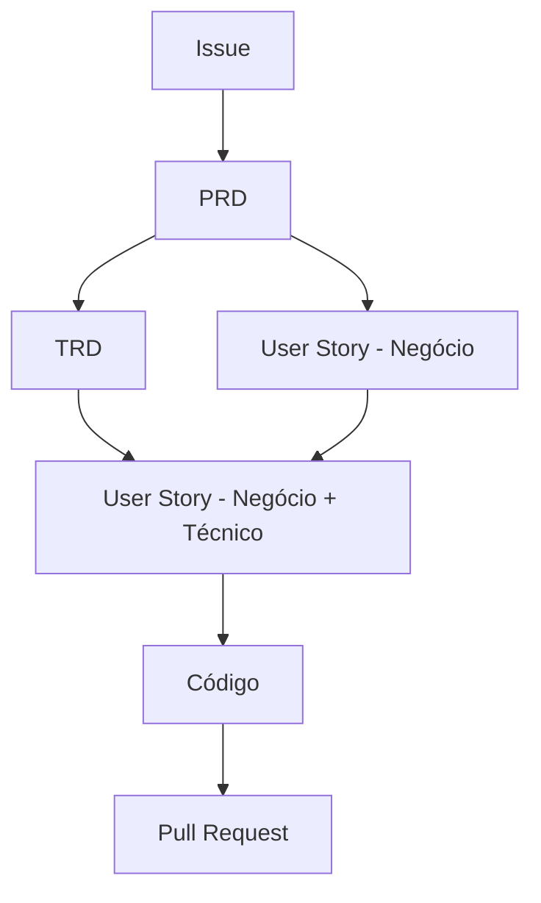
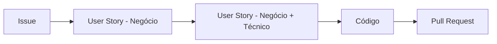

## Uso

### Via Prompt

```
> Crie um PRD para [feature] usando o template em .github/skills/tech-spec-documentation/references/prd-template.md
> Crie um TRD para [feature] usando o template em .github/skills/tech-spec-documentation/references/trd-template.md
> Crie uma User Story de negócio para [feature] usando o template em .github/skills/tech-spec-documentation/references/user-story-business-template.md
> Expanda a User Story US-XXXX para o formato completo usando o template em .github/skills/tech-spec-documentation/references/user-story-complete-template.md
```

### Via Script

```bash
# Gerar PRD
.github/skills/tech-spec-documentation/scripts/generate-prd.sh "Sistema de Notificações" docs/prd/

# Gerar User Story de negócio
.github/skills/tech-spec-documentation/scripts/generate-user-story.sh "Cadastro de Contrato" docs/stories/

# Validar documentação
.github/skills/tech-spec-documentation/scripts/validate-docs.sh docs/
```

## Templates Disponíveis

| Template | Arquivo | Responsável | Propósito |
|----------|---------|-------------|----------|
| PRD | `.github/skills/tech-spec-documentation/references/prd-template.md` | PM / PO | Define o problema e requisitos de produto |
| TRD | `.github/skills/tech-spec-documentation/references/trd-template.md` | Tech Lead / Arquiteto | Detalha a solução técnica |
| RFC | `.github/skills/tech-spec-documentation/references/rfc-template.md` | Engenheiro | Propõe mudanças técnicas para discussão |
| ADR | `.github/skills/tech-spec-documentation/references/adr-template.md` | Quem decidiu | Registra decisões arquiteturais tomadas |
| User Story — Negócio | `.github/skills/tech-spec-documentation/references/user-story-business-template.md` | PO | História focada apenas nos aspectos de negócio |
| User Story — Completa | `.github/skills/tech-spec-documentation/references/user-story-complete-template.md` | Tech Lead | História com negócio + detalhes técnicos |

## Workflow de User Stories — Fluxo PO → Tech Lead

### Cenário Complexo (épicos / features com impacto arquitetural)



### Cenário Simples (histórias pontuais / melhorias)



**Regras de escolha do cenário:**

| Critério | Cenário Simples | Cenário Complexo |
|----------|----------------|------------------|
| Impacto arquitetural | Não | Sim |
| Múltiplas integrações novas | Não | Sim |
| Decisões técnicas a registrar (ADR/RFC) | Não | Sim |
| Envolve novo microsserviço ou domínio | Não | Sim |
| Melhoria em funcionalidade existente | Sim | — |

**Papéis no fluxo:**

1. **PO** usa `.github/skills/tech-spec-documentation/references/user-story-business-template.md` com IA para criar a história focando nos critérios de aceite, regras de negócio, riscos e dependências — **sem detalhes técnicos**.
2. **Tech Lead** usa `.github/skills/tech-spec-documentation/references/user-story-complete-template.md` com IA conectada ao(s) repositório(s) para expandir a história com regras técnicas, mapeamentos REST, Collections MongoDB, integrações e informações de infraestrutura. No cenário complexo, usa também o TRD como insumo.

## Estrutura de Saída Recomendada

```
docs/
├── prd/
│   ├── PRD-001-health-check.md
│   └── PRD-002-notifications.md
├── stories/
│   ├── US-001-negocio.md        # Criada pelo PO (somente negócio)
│   ├── US-001-completa.md       # Expandida pelo TL (negócio + técnico)
│   └── US-001-JIRA.md           # Versão formatada para Jira
├── trd/
│   ├── TRD-001-health-check.md
│   └── TRD-002-notifications.md
├── rfc/
│   └── RFC-002-realtime-protocol.md
├── adr/
│   └── ADR-002-websocket-socketio.md
└── diagrams/
    ├── architecture.mmd
    └── sequence-notifications.mmd
```

## Integrações

- Use a ferramenta `diagramas_gerar_diagrama` da BIA Tech MCP para a geração dos diagramas.
- Use o `./scripts/convert-md-to-jira` para converter arquivos markdown para a sintaxe do Jira quando necessário.